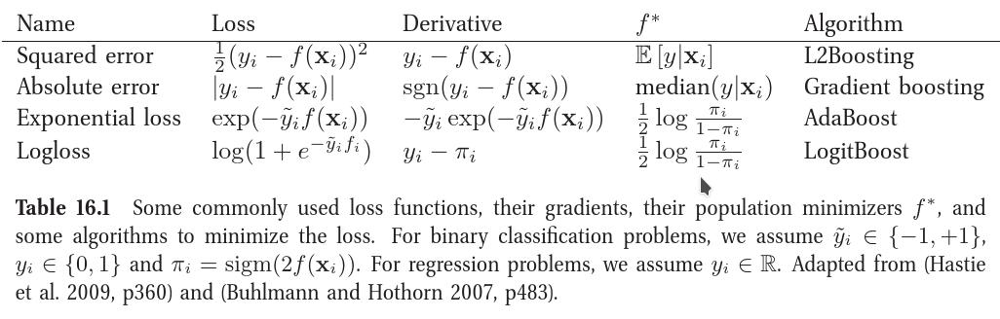

集成学习最基本的思想是构建多个分类器，用某种策略将多个结果集成，输出最终学习的结果。相比单个的模型，集成学习模型由于学习了多个子模型，会获得“更好一点”的结果。Kaggle上的大杀器`XGBoost`和`Random Forest`分别均属于集成学习模型。

## Voting Classifiers：多分类器角度

最容易理解的选举方法，接收多个分类器的结果进行投票，得分最高的结果作为最终输出。

## Bagging & Pasting：多重采样角度

`Bagging（bootstrap aggregating）`方法重点在于bootstrap抽样方法。`bootstrap（自助法）`是有放回的抽样方法，得到统计量的分布以及置信区间。

>  When sampling is performed with replacement, this method is called bagging1 (short for bootstrap aggregating). When sampling is performed without replacement, it is called pasting


sk-learn中的BaggingClassifier使用：

```python
from sklearn.ensemble import BaggingClassifier
from sklearn.tree import DecisionTreeClassifier

bag_clf = BaggingClassifier(
    DecisionTreeClassifier(), 
    n_estimators=500,
    max_samples=100, 
    bootstrap=True, 
    n_jobs=-1
)

bag_clf.fit(X_train, y_train)
y_pred = bag_clf.predict(X_test)
```

> Decision trees are sensitive to the specific data on which they are trained. 
> If the training data is changed (e.g. a tree is trained on a subset of the 
> training data) the resulting decision tree can be quite different and in 
> turn the predictions can be quite different.

bootstrap方法抽样中大部分样本会多次被抽取出来输入到分类器，有一部分则从未被抽取，这部分样本一般称为`out-of-bag (oob) instances`，bagging外的样本因为从未被使用，可以用来做交叉验证。`BaggingClassifier`中的`oob_score_`就是这部分样本的验证分数。

## Random Forest

随机森林是Boosting方法的代表作，在Kaggle上经常看到用这个模型。

### 优点
- 在数据集上表现良好（随机boosting抽样，保证样本空间多样性，由于每一棵树的样本都不是全部的样本，相对不容易over-fitting。正因为这个原因，随机森林无需刻意剪枝）
- 它能够处理很高维度（feature很多）的数据，并且不用做特征选择
- 在训练完后，它能够给出哪些feature比较重要（有降维过程）
- 在创建随机森林的时候，对generlization error使用的是无偏估计（？）
- 训练速度快（子节点运用决策树的话计算熵或者信息增益相对更快）
- 在训练过程中，能够检测到feature间的互相影响（？）
- 容易并行优化（树结构模型，易并行分配计算任务）


### 算法描述

对于数据集D，集成模型总数T，子空间维度d：
1. 对于每一个子模型 t (t < T)，从D中随即有放回地抽样得到样本集$$D_t$$
2. 随机选择d个特征，由此降低$$D_t$$的维度到d
3. 以无剪枝的方式在$$D_t$$上构建树模型$$M_t$$
4. 重复1～3直到得到T个集成模型，对模型$$M_1,M_2..M_t$$进行结果集成，对于每个测试集由投票选择输出结果。

决策树模型对训练数据的变化非常敏感，所以Bagging方法十分有用，它增强了集成模型的样本多样性，还可以减少每颗树的计算时间。

>
> The difference between Random Forest algorithm and the decision tree algorithm is that in Random Forest, 
> the process es of finding the root node and splitting the feature nodes will run randomly.


## Boosting
Boosting为了增加训练集的多样性，采取了更复杂的抽样方法。目前比较流行的当属`Adaptive Boost`和`Gradient Boost`方法。

>  The general idea of most boosting methods is to train predictors sequentially, each trying to correct its prede‐cessor. 

### 概述

boosting的目标是解决下面的优化问题：

$$
min_{f(x)} \sum_{i=1}^{N} L(y_i,f(x_i))
$$

常见的损失函数如下表：



这几个boost算法几乎上是从不同损失函数的角度来逼近最优解。

### L2Boosting

使用最简单的平方差损失函数，在第 m 步可以得到：
$$
L(y_i, f_{m-1}(x_i) + \beta h(x_i; \alpha)) = (\hat{y_i}-h(x_i;a))^2
$$
其中
$$
\hat{y_i} = y_i-f_{m-1}(x_i)
$$
即当前模型的残差。当设置$$\beta = 1$$时，得到的就是L2Boosting优化算式。

### Adaptive Boost

采用加权的方法，对**错分样本**加重权值输入到下一个模型，最后将所有模型集成投票输出最终结果。

> For example, to build an AdaBoost classifier, a first base classifier (such as a Decision Tree) is
> trained and used to make predictions on the training set. The relative weight of misclassified 
> training instances is then increased. A second classifier is trained using the updated weights 
> and again it makes predictions on the training set, weights are updated, and so on 


#### 算法描述

1. Draw a random subset of training samples `d1` without replacement from training set `D` to train a weak learner `C1`.
2. Draw a second random training subset `d2` without replacement from the training set and add `50 percent` of the samples that were previously misclassified to train a weak learner `C2`.
3. Find the training samples `d3` in training set `D` , which `C1` and `C2` disagree upon, to train a third weak learner `C3`.
4. Combine the weak learners `C1`, `C2`, and `C3` via majority voting.

#### 权重更新策略和置信系数

Boosting权重更新的思想是总权值的一半赋给错分样本。如最初所有样本上的权重和为1,错分样本即错误率`e`。则第一次提升权值后，错分样本权值提升 `1/2e`，正确的样本权重提升`1/2(1-e)`。这样，对于`e < 0.5`的子模型，这种权重更新方法将确保错分样本权重提升而正确样本的权重下降，最后将权重进行归一化确保所有权总和为1,方便下次权重提升。

此外，Boosting算法对每个子模型引入一个置信系数`a`,显然`a`应当随着`e`的减小而增加。一种常见的选择是：

$$
a_j = \frac{1}{2} \ln \frac{1-e_j}{e_j} = \ln \sqrt{\frac{1-e_j}{e_j}} 
$$

权重和置信系数更新流程：
1. Set the weight vector **w** to uniform weights, where $$\sum_i{w_i} = 1$$
2. For **j** in **m** boosting rounds, do the following:
   
    a. Train a weighted weak learner: $$C_j = train( X , y, w).$$

    b. Predict class labels: $$\hat{y}= M_j = predict(C_j,X)$$
    
    c. Compute weighted error rate: $$e = w \cdot ( y \ne \hat{y} )$$.
    
    d. Compute coefficient: $$a_j = \frac{1}{2} \ln \frac{1-e_j}{e_j} = \ln \sqrt{\frac{1-e_j}{e_j}} $$
    
    e. Update weights (boost): 
        $$
            w := \begin{cases} \frac{w}{2e_j}, \text{if }(y \ne \hat{y}) 
                 \\ \frac{w}{2(1-e_j)} \text{if }(y = \hat{y}) \end{cases}
        $$  
    

    > 此处权重更新还有一种常见方式为:
    > $$
    >     w := exp(-a_j \times y \times \hat{y})
    > $$
    > 当$$y$$和$$\hat{y}$$不等时, $$y \times \hat{y}= -1$$否则为1. 这样可保证错分样本权重的增加。

    f. Normalize weights to sum to 1: $$w := \frac{w}{\sum_i{w_i}} $$

3. Compute the final prediction: 
$$
\hat{y} =  (\sum_{j=1}^{m} (a_j \times M_j) > 0) = (\sum_{j=1}^{m} (a_j \times predict(C_j,X)) > 0)
$$


`AdaBoost`的损失函数形式：
$$
L(f) = \frac{1}{m} \sum_{1}^{m} e^{-y_i f(x_i)} = \frac{1}{m} \sum_{1}^{m} e^{-y_i \sum_{j=1}^{N} a_jh_j(x_i)}
$$

sklearn中`AdaBoostClassifier`分类器实现了该算法。

```python
from sklearn.ensemble import AdaBoostClassifier
ada_clf = AdaBoostClassifier(
    DecisionTreeClassifier(max_depth=1), 
    n_estimators=200, 
    algorithm="SAMME.R", 
    learning_rate=0.5)
ada_clf.fit(X_train, y_train)
```
### Gradient Boost

`Gradient Boosting = Gradient Descent + Boosting`，Gradient Boost与传统的Boost的区别是，每一次的计算是为了减少上一次的残差(residual)，而为了消除残差，在残差减少的梯度(Gradient)方向上建立一个新的模型。每个新的模型的生成是为了使之前模型的残差往梯度方向减少，与传统Boost对正确、错误的样本进行加权有着很大的区别。 

**Hands-On Machine Learning with Scikit-Learn and TensorFlow**中手动实现了一个简单的Gradient Boosted Regression Trees (GBRT)例子，通过多次对错分集进行训练得到多个子模型，最后对各个子模型输出`求和`得到最终输出。该例子十分直观。这里定义的`残差`就是`L2Boosting`的`Derivative`。

> Let’s go through a simple regression example using Decision Trees as the base predictors (of course Gradient Boosting also works great with regression tasks). This is called Gradient Tree Boosting, or Gradient Boosted Regression Trees (GBRT). First, let’s fit a DecisionTreeRegressor to the training set (for example, a noisy quadratic training set):

```python
from sklearn.tree import DecisionTreeRegressor
tree_reg1 = DecisionTreeRegressor(max_depth=2)
tree_reg1.fit(X, y)
```

> Now train a second DecisionTreeRegressor on the residual errors made by the first predictor:

```python
y2 = y - tree_reg1.predict(X)
tree_reg2 = DecisionTreeRegressor(max_depth=2)
tree_reg2.fit(X, y2)
```

> Then we train a third regressor on the residual errors made by the second predictor:

```python
y3 = y2 - tree_reg2.predict(X)
tree_reg3 = DecisionTreeRegressor(max_depth=2)
tree_reg3.fit(X, y3)
```

> Now we have an ensemble containing three trees. It can make predictions on a new instance simply by adding up the predictions of all the trees:

```python
y_pred = sum(tree.predict(X_new) for tree in (tree_reg1, tree_reg2, tree_reg3))
```

为防止出现过拟合，训练时可以使用`early-stop`方法，当全局损失连续多次不下降时停止训练。


#### 算法描述

**Greedy Function Approximation: A gradient Boosting Machine**论文中给出的Gradient Boost基础算法流程如下：

1. 初始化损失函数
$$
F_0(x) = arg min_{\rho} \sum_{1=1}^N {L(y_i, \rho)}
$$


2. 逐步构建子模型，对于每个模型（最多M个模型）$$F_m(x)$$

    $$
    \hat y_i  = -\Bigl[{\frac{\partial L(y_i,F(x_i))}{\partial F(x_i)}} \Bigr] _{F(x)=F_{m-1}(x)}  ，(i=1,N)
    $$


    $$
    a_m=argmin_{a,\beta} \sum_{i=1}^N[\hat{y_i}-\beta h(x_i;a)]^2)
    $$

    $$
    \rho_m = argmin_{\rho}\sum_{i=1}^NL(y_i, F_{m-1}(x_i)+\rho h(x_i;a_m))
    $$

    $$
    F_m(x) = F_{m-1}(x)+\rho_m h(x;a_m)
    $$

论文中的详细算法解读参见另外一篇文章。

### Stacking（Meta Ensembling）
Hands-On Machine Learning with Scikit-Learn and TensorFlow一书最后介绍了`stacking`方法。主要思想：对每个子模型的输出再次进行学习，训练出一个混合器（`Blender`）。

>  It is based on a simple idea: instead of using trivial functions (such as hard voting) to aggregate the predictions of all predictors in an ensemble,why don’t we train a model to perform this aggregation? Figure 7-12 shows such an ensemble performing a regression task on a new instance. Each of the bottom three predictors predicts a different value (3.1, 2.7, and 2.9), and then the final predictor (called a blender, or a meta learner) takes these predictions as inputs and makes the final prediction (3.0).


具体过程：
1. 将测试集s分为两部分s1、s2
2. 使用s1训练第一层中的子模型，子模型各不相同以保证模型多样性（相当于从不同的角度观察数据）。
3. 将s2数据集输入到第一层中的模型，其输出和目标作为第二层的数据集训练出混合器`Blender`。

> It is actually possible to train several different blenders this way (e.g., one using Linear Regression, another using Random Forest Regression, and so on): we get a whole layer of blenders. The trick is to split the training set into three subsets: the first one is used to train the first layer, the second one is used to create the training set used to train the second layer (using predictions made by the predictors of the first layer),and the third one is used to create the training set to train the third layer (using predictions made by the predictors of the second layer). Once this is done, we can make a prediction for a new instance by going through each layer sequentially

更复杂点，还可以构造一个`Blender层`，该层每个`Blender`使用不同的模型，最后集成到第三层的`Blender`得到最终输出，其中的技巧在于将第二层的训练数据分成三份，每个层一份不同的训练集。

## 方差和偏差

`Bagging主要是一种降低方差的技术（样本多样性，减小样本差异敏感程度），而Boosting主要用于减小偏差（对残差再次加重训练从而减小偏差）`


### 参考
- Hands-On Machine Learning with Scikit-Learn and TensorFlow
- Greedy Function Approximation: A gradient Boosting Machine
- https://en.wikipedia.org/wiki/Gradient_boosting
- 《机器学习》 弗拉赫 (Peter Flach），人民邮电出版社
- http://www.scholarpedia.org/article/Ensemble_learning
- http://blog.kaggle.com/2016/12/27/a-kagglers-guide-to-model-stacking-in-practice/
- https://www.kaggle.com/arthurtok/introduction-to-ensembling-stacking-in-python
